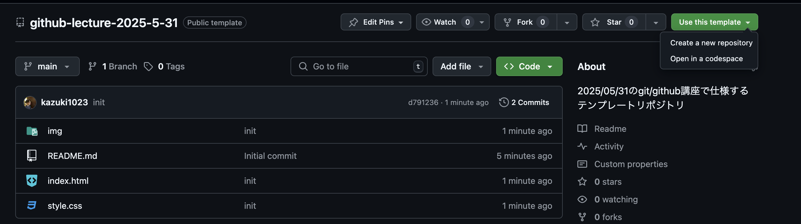
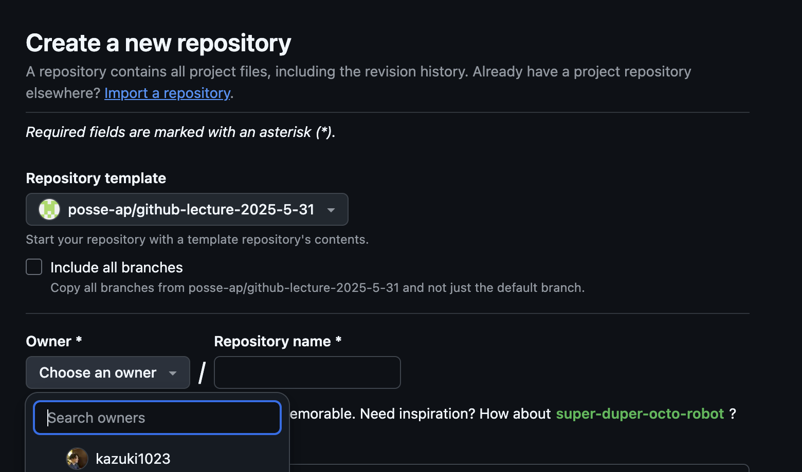
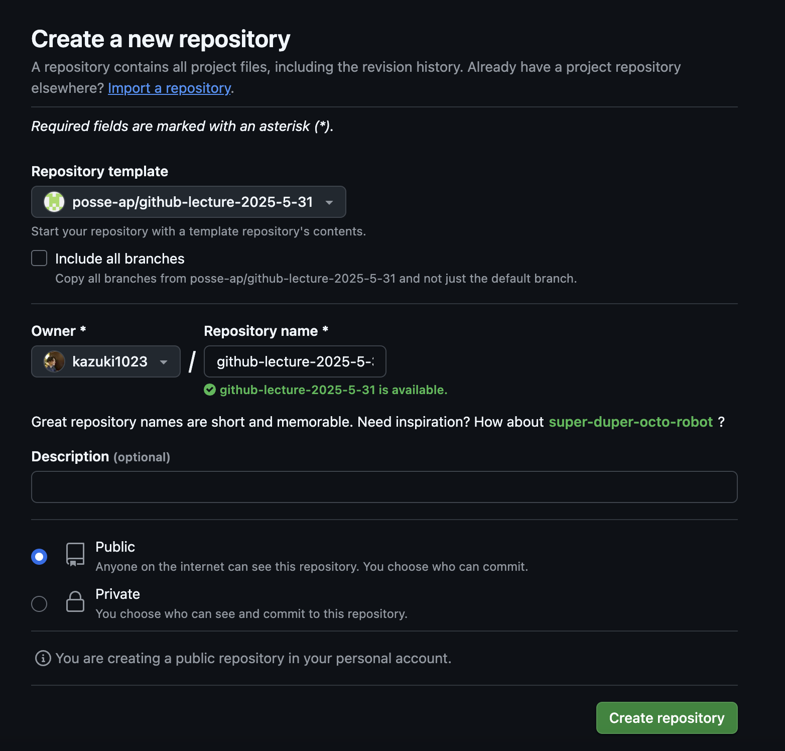
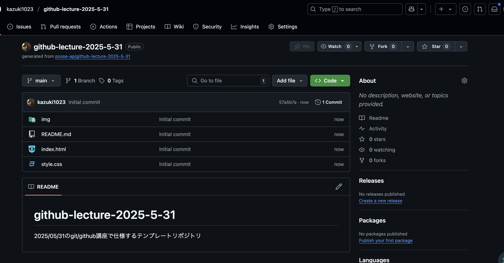

# github-lecture-2025-08-11 
2025/08/11のgit/github講座で仕様するテンプレートリポジトリ

## 使い方
1. `use thie template` を押して、`create a new repository` を押す

2. `Create a new repository` という画面が出てくるので、`owner` に自分のアカウントを選択

3. `Repository name` を好きな名前にして、`Public` を選択。そして `Create repository` を押す

4. 下記のようになっていたら完了です！ここからはスライドにあるように `git clone` すれば大丈夫です！

